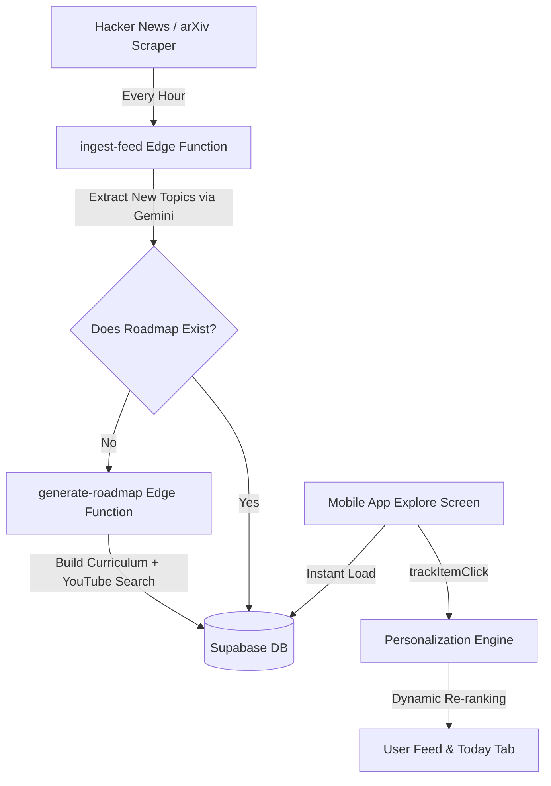

# 🗺️ Scout AI: The Ultimate Product & Technical Blueprint

This document serves as the **Master Blueprint and Technical Source of Truth** for Scout AI. It maps out our ultimate vision for every single component of the application, captures every breakthrough we have built so far, and outlines exactly what is left to turn Scout AI into the world's #1 personalized AI Mentor.

---

## 1. 💡 App Philosophy & Core Objective

Scout AI is engineered to be a **one-stop personalized AI mentor ecosystem** that integrates seamlessly into a user's daily routine. It is designed to scale with a user's growing intelligence—guiding them from absolute curiosity (Beginner) to technical execution (Expert). 

It acts as the **"Google Chrome & Netflix of AI"**—beautiful, highly interactive, precomputed, and extremely fast, while silently observing user interests to personalize their learning experience.

---

## 2. 🗂️ Core Features Breakdown

Below is the exhaustive breakdown of each feature, its ultimate product goal, its current implementation status, and exactly what needs to be built next.

### 🎥 Feature A: Dynamic Explore Hub ("Netflix for AI")
*   **The Ultimate Goal:** A gorgeous, nested "drill-down" visual navigation interface (Root Category $\rightarrow$ Sub-field $\rightarrow$ Roadmap timeline sheet) modeled after premium learning paths (like Striver DSA sheets). The timeline steps act as a structured curriculum with curated high-quality YouTube videos and papers.
*   **Built So Far:**
    *   Re-designed `ExploreScreen.js` with stack-based local navigation to support deeply nested subfields without lag.
    *   Wrote the database schema (`ai_fields` and `ai_roadmaps` tables) in Supabase.
    *   Created `populate.js` to bulk-generate high-quality progressive roadmaps using our backend Edge Function.
    *   Integrated Deno-based `generate-roadmap` Edge Function powered by Gemini 2.5 Flash to automatically curate progressive curriculums.
*   **What is Left:**
    *   Enhance the visual cards with rich custom icons, harmonious colors, and subtle micro-animations (glassmorphism/gradients).
    *   Add a checkmark/completion state on each timeline step in the UI so the user can tick off lessons like a checklist, storing their progress in Supabase.

---

### 🕷️ Feature B: The Infinite Knowledge Expander (Backend Pipeline)
*   **The Ultimate Goal:** A completely automated, zero-latency system. As our automated scraper ingests global AI news, it extracts emerging terms (e.g., "Sora" or "Voice Agents"). If the database lacks a roadmap for that term, a background process automatically generates a high-quality curriculum. The next time the user opens the app, it is already precomputed and instantly available without loading spinners.
*   **Built So Far:**
    *   Integrated the `expandKnowledgeGraph` module directly into the `ingest-feed` Edge Function.
    *   The engine analyzes the top news headlines using Gemini, extracts newly emerging subfields, slugs them, checks the DB, and triggers `generate-roadmap` to pre-generate the curriculum.
*   **What is Left:**
    *   Set up a production Supabase Cron trigger (`pg_net` or edge cron) to automatically ping `ingest-feed` every 6 to 12 hours so the knowledge expander runs completely autonomously in the background.

---

### 🕵️ Feature C: The Silent Personalized Tracking Engine ("The Invisible Hand")
*   **The Ultimate Goal:** The app acts as an invisible personal assistant. It silently tracks user search queries, article clicks, and completed roadmap steps. Using this, the app continuously ranks news articles and daily topics to prioritize their specific interest (e.g. advanced model fine-tuning vs. beginner prompt tips) while maintaining a **Smart Override** for breaking global events.
*   **Built So Far:**
    *   Created the backend `mark_topic_complete` SQL procedure to handle LeetCode-style streak resets.
    *   Implemented the `trackItemClick` context hook which dynamically re-ranks the Today screen feed based on user click patterns.
*   **What is Left:**
    *   Connect the `trackItemClick` engine to the roadmap cards. Clicking a RAG step in the roadmap should immediately notify the tracking engine, which will then push advanced vector database news to the top of the user's feed.

---

### 🔍 Feature D: The "Super Search" Bar
*   **The Ultimate Goal:** A powerful search omni-box at the top of the Explore page. Instead of just doing basic text matching, if a user searches for a hyper-specific question (e.g., *"How do I run Llama 3 locally?"*), the backend leverages multi-model routing to instantly serve an answer, key articles, and a custom mini-curriculum.
*   **Built So Far:**
    *   Designed the UI Search Bar in `ExploreScreen.js`.
    *   Direct text matching exists for news items and daily topics.
*   **What is Left:**
    *   Connect the Explore search input to an Edge Function that queries Groq (Llama 3) for lightning-fast answer streaming and Gemini for deep resource mapping.

---

### 🛠️ Feature E: Trending AI Tools Directory
*   **The Ultimate Goal:** A beautiful, responsive grid/masonry layout on the Explore tab showcasing the newest AI tools, sorted by categories (Image Generation, Coding Assistants, Video, Writing). We will scrape this automatically from product-hunt-style platforms to keep Scout AI as the #1 discovery page.
*   **Built So Far:**
    *   Conceptualized UI structure.
*   **What is Left:**
    *   Add a new table `ai_tools` to the Supabase database.
    *   Build a scraping module in our Edge Function to grab trending tools and update the UI in `ExploreScreen.js`.

---

### 📚 Feature F: The "AI Dictionary" / Glossary
*   **The Ultimate Goal:** AI jargon (RAG, LoRA, Quantization) is confusing. A sleek, searchable A-Z glossary page will act as a reference dictionary. Tapping any term slides up a premium bottom sheet drawer displaying an "Explain it like I'm 5" definition and a button to go to a full learning lesson.
*   **Built So Far:**
    *   Conceptualized UX flow.
*   **What is Left:**
    *   Create a glossary table in Supabase.
    *   Implement the A-Z searchable layout and bottom sheet in `ExploreScreen.js`.

---

## 3. 🗺️ Project Architecture Map

---

## 4. 🚀 Next Steps Execution Plan

When you are ready to jump back in, here is our tactical checklist:

1.  **Finalize Roadmap Interaction:** Add step checklist tracking in the mobile UI to let users mark lessons as done.
2.  **Build the "Super Search" Engine:** Connect the Explore search bar to Groq/Llama 3.
3.  **Implement the AI Tools Directory:** Create the `ai_tools` DB table and build the visual directory.
4.  **Implement the AI Dictionary:** Design the dictionary slide-up drawer.

---
> [!NOTE]
> All built components (`populate.js`, `generate-roadmap`, and `ingest-feed`) are completely live, deployed, and fully connected to your production Supabase backend.
